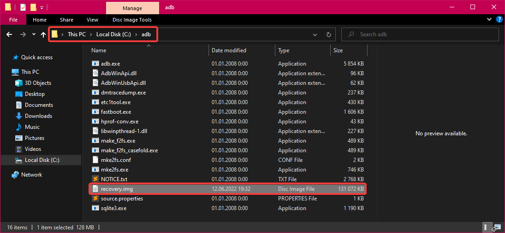
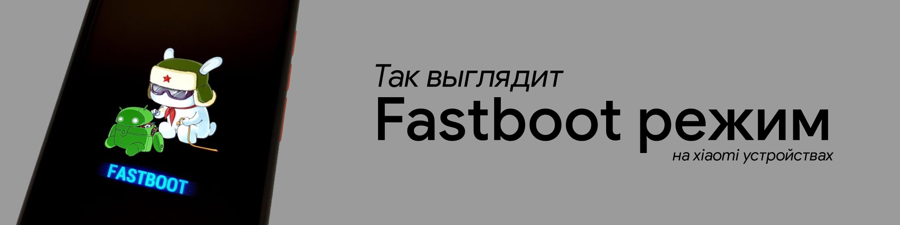

# Установка recovery через cmd (ПК)



1. Скачиваем Platform Tools на ПК — [скачать](https://dl.google.com/android/repository/platform-tools-latest-windows.zip)
2. Распаковываем скачанный архив в корень диска `C:\` и переименовываем в `adb`
3. Скачиваем и устанавливаем драйвера на ПК — [скачать](https://github.com/i1Last/ru-laib/raw/main/.gitbook/assets/ADB\_driver\_v1.17\_lite.zip)
4. Переименовываем наше рекавери в `recovery.img`, а после перемещаем его в ранее созданную папку adb \[`C:\adb`]
   * Как это должно выглядеть? Скриншот **** в правой колонке
5. Перезагружаем наш ПК









1. Переводим смартфон в режим fastboot
   1. Полностью выключите ваш смартфон
   2. Одновременно зажмите кнопку питания и кнопку громкости вниз (-)
   3. Ожидайте появления экрана, как на первом скриншоте в правой колонке &#x20;
2. Открываем cmd в ранее созданной папке `C:\adb`
   1. Заходим в папку `adb` на диске `C:\`
   2. В строке пути вводим `cmd` и нажимаем Enter ([как это сделать? видео](https://youtu.be/IPcTzLhBo38))
3. Подключаем смартфон, находящийся в режиме fastboot, к ПК (желательно оригинальным кабелем)
4. В открытой командной строке вводим `fastboot devices` для проверки корректного подключения смартфона к ПК. Сравните результат команды со вторым скриншотом из правой колонки
   * Ваше устройство должно определяться как `device`. Если это не так или у вас вообще ничего не происходит, то это значит, что вы сделали что-то не так. Вам стоит повторить все действия сначала или проверить корректность их выполнения.
5. Если у вас все хорошо, то прописываем команду `fastboot flash recovery recovery.img`
   * **Внимание**: чтобы эта команда выполнилась, вы, как и было написано в пунктах выше, должны были переместить скачанное вами рекавери в формате `*.img` в папку adb \[`C:\adb`] и переименовать его в `recovery.img` ([как это должно выглядеть? скриншот](https://i.imgur.com/TCI0yMP.png))
6. После завершения процесса прописываем команду `fastboot reboot recovery`&#x20;
   * Эта команда перезагрузит ваше устройство в рекавери. Чтобы попасть в рекавери вручную:
     1. Полностью выключите ваше устройство
     2. Зажмите кнопку питания и кнопку громкости вверх (+) до появления лого TWRP








<mark style="color:red;">**ВНИМАНИЕ:**</mark> Если после установки recovery вы перезагрузитесь в стоковую MIUI, то ваше twrp слетит! Чтобы это предотвратить, вам необходимо либо прошить [magisk](../repo/main-files/magisk.md), либо прошить определенный патч (обычно все прошивают magisk).

